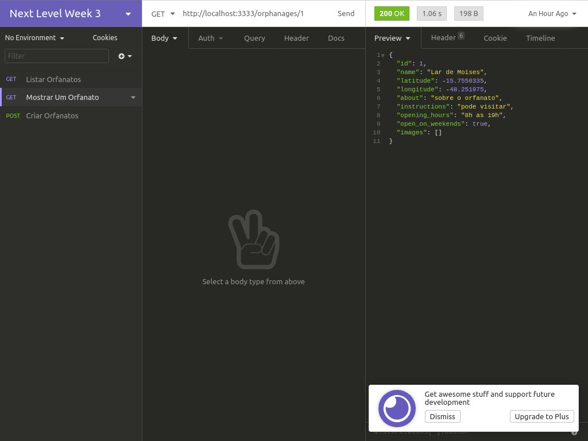
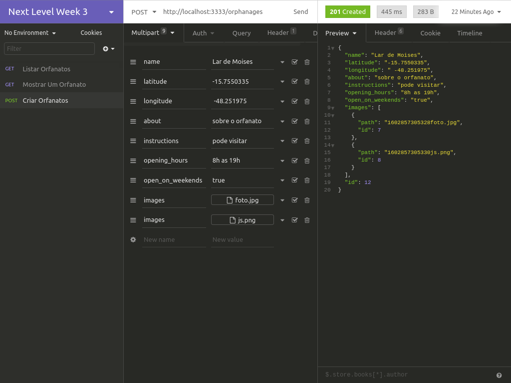
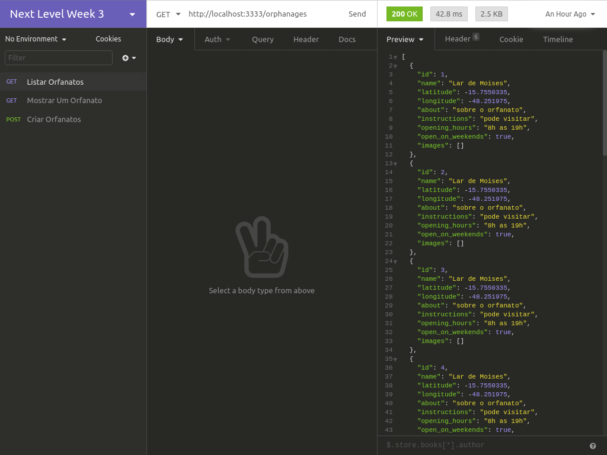

<h1 align="center">
  
</h1>

<h2 align="center"> Aplicação para organização de visitas nos orfanatos</h2>

<h3 align="center">
  Happy - Aplicação Backend com NodeJs e com Typescript
</h3>
<h4>
    Leve felicidade para o mundo, visite orfanatos e mude o dia de muitas crianças. NLW#3
</h4>

  

  

  

  <a href="#-projeto">Projeto</a>&nbsp;&nbsp;&nbsp;|&nbsp;&nbsp;&nbsp;
  <a href="#rocket-Tecnologias">Tecnologias</a>&nbsp;&nbsp;&nbsp;|&nbsp;&nbsp;&nbsp;
  <a href="#-como-contribuir">Como contribuir</a>

<h2 align="center">Criado com as Tecnologias :rocket: </h2>
<h3>
     Node Js
     Sqlite
     Typescript
</h3>

## 📱 Projeto

O Happy é uma aplicação web e mobile para organização de visitas em orfanatos.
Essa aplicação permite que, se você faz parte de um orfanato, cadastre ele no mapa e caso você queira visitar um orfanato e fazer o dia de muitas crianças mais feliz, este é o lugar que vai encontrar os orfanatos mais perto de você.

Este projeto foi construído durante a terceira edição do evento Next Level Week da <a href="https://rocketseat.com.br/">Rocketseat</a>
  🚀.

<h5 align="center">
  
</h5>
<h5 align="center">
  
</h5>
<h5 align="center">
  
</h5>

## 🤔 Como contribuir

- Faça um fork desse projeto;
- Crie uma branch com sua(s) mudança(s): `git checkout -b my-feature`;
- Faça um commit da(s) sua(s) mudança(s): `git commit -m 'feat: My new feature'`;
- Crie uma pull request nesse repositório.

---

With 💜, by Melqui Sodré.

[nodejs]: https://nodejs.org/
[yarn]: https://yarnpkg.com/
[vc]: https://code.visualstudio.com/
[vceditconfig]: https://marketplace.visualstudio.com/items?itemName=EditorConfig.EditorConfig
[vceslint]: https://marketplace.visualstudio.com/items?itemName=dbaeumer.vscode-eslint
[prettier]: https://marketplace.visualstudio.com/items?itemName=esbenp.prettier-vscode
